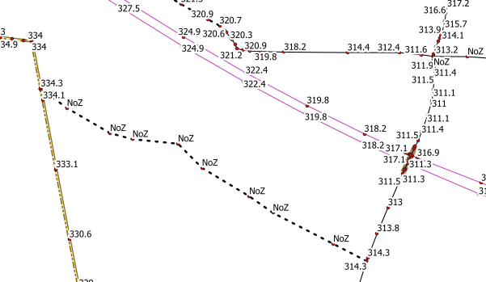

<table>
<colgroup>
<col style="width: 21%" />
<col style="width: 78%" />
</colgroup>
<tbody>
<tr>
<td rowspan="2"></td>
<td style="font-size: 24px;text-align: center;">
<strong>Manuel utilisateur du plugin
« VuesZ »</strong>

<strong>V0.3.2</strong>
</td>
</tr>
<tr>
<td style="font-size: 16px;text-align: center;">Développeur  : Gérôme PECHEUR (IGN)</td>
</tr>
</tbody>
</table>

**Sommaire**

- [1. Prérequis](#prerequis)

- [2. Présentation](#presentation)

- [3. Utilisation](#utilisation)

  <h2 id="prerequis" style="color: white;margin:0;" >1. Prérequis</h2>

Version de QGIS : version 3 supérieure à 3.28

Cette version est compatible QGIS 4.

Le plugin « maitre » doit préalablement être installé : 
[maitre-qgis-plugin sur GitHub](https://github.com/IGNF/maitre-qgis-plugin)

  <h2 id="presentation" style="color: white;margin:0;" >2. Présentation</h2>

Ce plugin permet d’afficher les valeurs Z de chaque sommet, pour tout
type de couche (ponctuelle, linéaire , surfacique)

Si une couche est de type 2D rien ne s’affichera.

  <h2 id="utilisation" style="color: white;margin:0;" >3. Utilisation</h2>

L’exécution de ce plugin affiche/masque les valeurs Z.
L’affichage se limite à la zone écran afin d’optimiser les temps de
calculs.

NoZ : correspond à des valeurs de Z non renseignées
